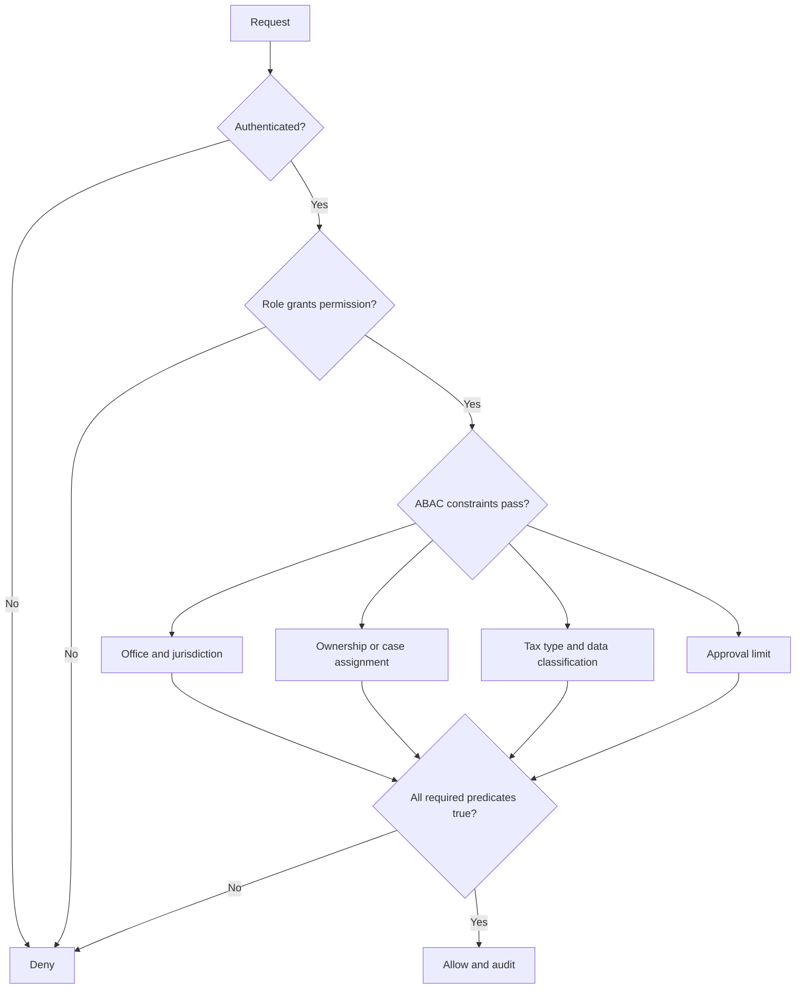

# Authorization decision

```mermaid
flowchart TD
  Q[Request] --> A{Authenticated?}
  A -- No --> D[Deny]
  A -- Yes --> R{Role grants permission?}
  R -- No --> D
  R -- Yes --> C{ABAC constraints pass?}
  C --> O[Office and jurisdiction]
  C --> W[Ownership or case assignment]
  C --> T[Tax type and data classification]
  C --> L[Approval limit]
  O --> P{All required predicates true?}
  W --> P
  T --> P
  L --> P
  P -- Yes --> G[Allow and audit]
  P -- No --> D
```
