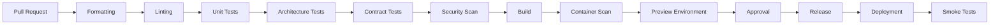

# CI/CD

```mermaid
flowchart LR
  PR[Pull Request] --> F[Formatting] --> L[Linting] --> U[Unit Tests] --> A[Architecture Tests] --> C[Contract Tests] --> S[Security Scan] --> B[Build] --> CS[Container Scan] --> P[Preview Environment] --> AP[Approval] --> R[Release] --> D[Deployment] --> SM[Smoke Tests]
```
