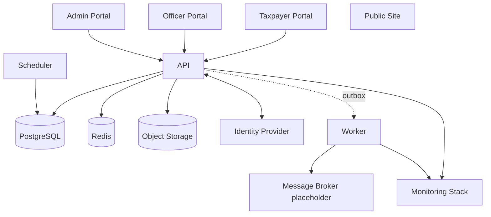

# Container diagram

```mermaid
flowchart TB
  TP[Taxpayer Portal] --> API[API]
  OP[Officer Portal] --> API
  AP[Admin Portal] --> API
  PS[Public Site]
  API --> PG[(PostgreSQL)]
  API --> R[(Redis)]
  API --> OS[(Object Storage)]
  API <--> IDP[Identity Provider]
  API -. outbox .-> W[Worker]
  S[Scheduler] --> PG
  W --> MB[Message Broker placeholder]
  API --> M[Monitoring Stack]
  W --> M
```
