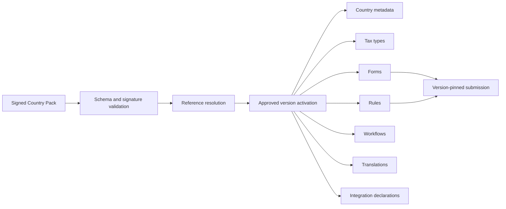

# Country-pack loading

```mermaid
flowchart LR
  P[Signed Country Pack] --> V[Schema and signature validation] --> R[Reference resolution] --> A[Approved version activation]
  A --> M[Country metadata]
  A --> T[Tax types]
  A --> F[Forms]
  A --> C[Rules]
  A --> W[Workflows]
  A --> L[Translations]
  A --> I[Integration declarations]
  F --> S[Version-pinned submission]
  C --> S
```
