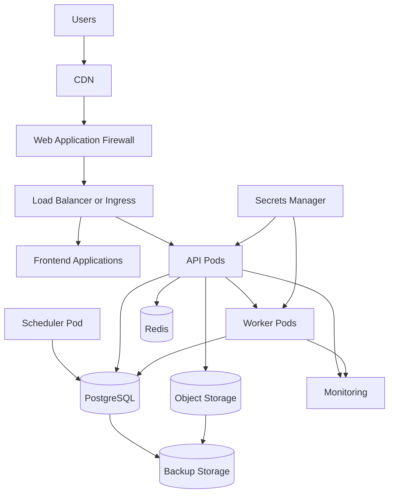

# Deployment

```mermaid
flowchart TB
  U[Users] --> CDN[CDN] --> WAF[Web Application Firewall] --> LB[Load Balancer or Ingress]
  LB --> FE[Frontend Applications]
  LB --> API[API Pods]
  API --> W[Worker Pods]
  S[Scheduler Pod] --> PG[(PostgreSQL)]
  API --> PG
  W --> PG
  API --> R[(Redis)]
  API --> O[(Object Storage)]
  API --> M[Monitoring]
  W --> M
  SM[Secrets Manager] --> API
  SM --> W
  PG --> B[(Backup Storage)]
  O --> B
```
