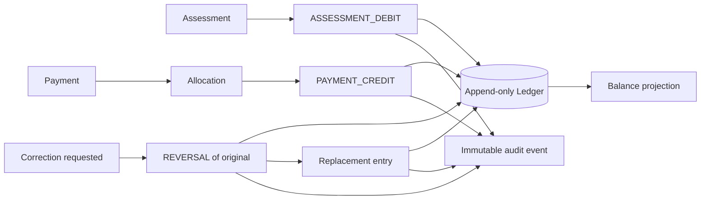

# Ledger posting flow

```mermaid
flowchart LR
  A[Assessment] --> AD[ASSESSMENT_DEBIT] --> L[(Append-only Ledger)]
  P[Payment] --> AL[Allocation] --> PC[PAYMENT_CREDIT] --> L
  L --> B[Balance projection]
  E[Correction requested] --> R[REVERSAL of original] --> L
  R --> N[Replacement entry] --> L
  AD --> U[Immutable audit event]
  PC --> U
  R --> U
  N --> U
```
