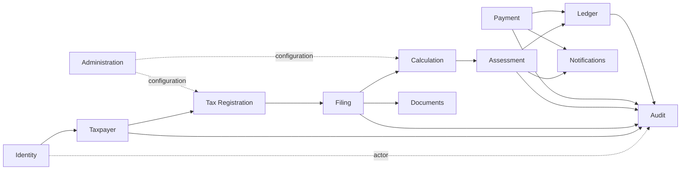

# Modular monolith

```mermaid
flowchart LR
  I[Identity] --> T[Taxpayer] --> R[Tax Registration] --> F[Filing] --> C[Calculation] --> A[Assessment] --> L[Ledger]
  P[Payment] --> L
  F --> D[Documents]
  A --> N[Notifications]
  P --> N
  AD[Administration] -. configuration .-> R
  AD -. configuration .-> C
  I -. actor .-> AU[Audit]
  T --> AU
  F --> AU
  A --> AU
  P --> AU
  L --> AU
```
