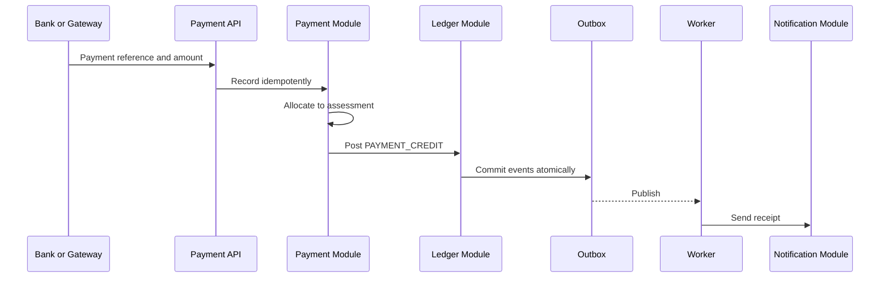

# Payment allocation

```mermaid
sequenceDiagram
  participant Bank as Bank or Gateway
  participant API as Payment API
  participant Payment as Payment Module
  participant Ledger as Ledger Module
  participant Outbox
  participant Worker
  participant Notify as Notification Module
  Bank->>API: Payment reference and amount
  API->>Payment: Record idempotently
  Payment->>Payment: Allocate to assessment
  Payment->>Ledger: Post PAYMENT_CREDIT
  Ledger->>Outbox: Commit events atomically
  Outbox-->>Worker: Publish
  Worker->>Notify: Send receipt
```
