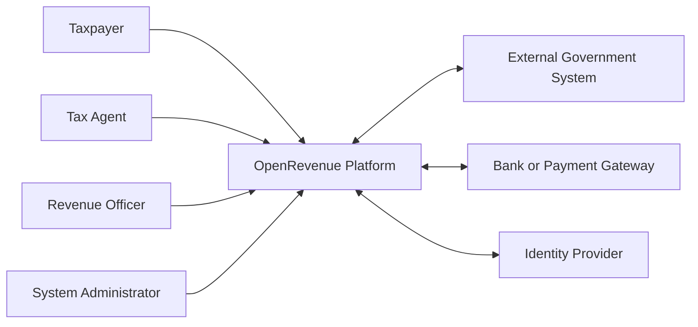

# System context

```mermaid
flowchart LR
  T[Taxpayer] --> O[OpenRevenue Platform]
  A[Tax Agent] --> O
  R[Revenue Officer] --> O
  S[System Administrator] --> O
  O <--> G[External Government System]
  O <--> B[Bank or Payment Gateway]
  O <--> I[Identity Provider]
```
