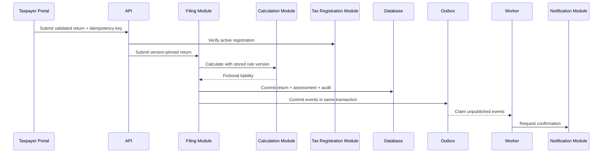

# Tax-return submission

```mermaid
sequenceDiagram
  participant Portal as Taxpayer Portal
  participant API
  participant Filing as Filing Module
  participant Calc as Calculation Module
  participant Reg as Tax Registration Module
  participant DB as Database
  participant Outbox
  participant Worker
  participant Notify as Notification Module
  Portal->>API: Submit validated return + idempotency key
  API->>Reg: Verify active registration
  API->>Filing: Submit version-pinned return
  Filing->>Calc: Calculate with stored rule version
  Calc-->>Filing: Fictional liability
  Filing->>DB: Commit return + assessment + audit
  Filing->>Outbox: Commit events in same transaction
  Outbox-->>Worker: Claim unpublished events
  Worker->>Notify: Request confirmation
```
